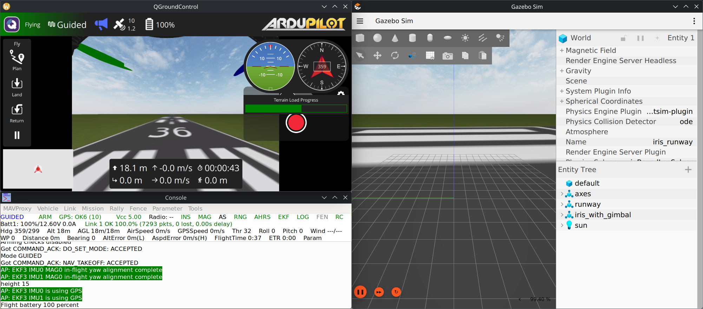

# Simulação do Drone

Ambiente containerizado com [Podman](https://podman.io/) para simulação de drones, integrando o controlador de voo [ArduPilot SITL](https://ardupilot.org/dev/docs/sitl-simulator-software-in-the-loop.html) com o simulador 3D [Gazebo Harmonic](https://gazebosim.org/docs/harmonic/). Desenvolvido para funcionar em **Linux**, sem a necessidade de instalar dependências diretamente no sistema operacional.

<!-- TOC -->
- [Visão Geral](#visão-geral)
- [Pré-requisitos](#pré-requisitos)
- [Instalação Rápida](#instalação-rápida)
- [Uso](#uso)
- [Conectando um GCS Externo](#conectando-um-gcs-externo)
- [Streaming de Vídeo](#streaming-de-vídeo-câmera-do-gazebo)
- [Personalização](#personalização)
- [Estrutura do Projeto](#estrutura-do-projeto)
- [Solução de Problemas](#solução-de-problemas)
<!-- /TOC -->



---

## Visão Geral

O projeto executa dois contêineres dentro de um **Pod** Podman, que se comunicam via rede local (`hostNetwork`):

```
┌─────────────────────────────── Pod (drone-sim) ────────────────────────────────┐
│                                                                                │
│  ┌─────────────────────┐    UDP/JSON (9005)    ┌────────────────────────────┐  │
│  │   ArduPilot SITL    │◄─────────────────────►│     Gazebo Harmonic        │  │
│  │  (controlador de    │                       │  (física, sensores, 3D)    │  │
│  │   voo simulado)     │                       │  GPU AMD (/dev/dri, /kfd)  │  │
│  └──────┬──────────────┘                       └──────────┬─────────────────┘  │
│         │ TCP                                             │ UDP                │
│         │ 5760, 5762, 5763                                │ 5600               │
└─────────┼─────────────────────────────────────────────────┼────────────────────┘
          ▼                                                 ▼
    GCS Externo                                      Streaming de Vídeo
    (Mission Planner,                                (GStreamer,
    QGroundControl,                                  ffmplay,
    MAVProxy)                                        OBS)
```

| Componente | Descrição |
|---|---|
| **ArduPilot SITL** | Simula o controlador de voo do drone. Recebe comandos MAVLink e envia estado do veículo. |
| **Gazebo Harmonic** | Simula a física, sensores (IMU, GPS, câmera) e renderiza o ambiente 3D. Comunica-se com o ArduPilot via JSON. |

### Portas de Rede

| Porta | Protocolo | Uso |
|---|---|---|
| `5760` | TCP | Conexão MAVLink primária (GCS externo) |
| `5762` | TCP | Conexão MAVLink secundária |
| `5763` | TCP | Conexão MAVLink terciária |
| `9005` | UDP | Comunicação interna ArduPilot <-> Gazebo (JSON SITL) |
| `5600` | UDP | Streaming de vídeo (GStreamer) |

---

## Pré-requisitos

### Sistema Operacional
- **Linux** ou **WSL** com passthrough de GPU

### Hardware
- **GPU** (necessária para o Gazebo Harmonic, mesmo que integrada)

### Software

Verifique se as seguintes ferramentas estão instaladas:

```bash
podman --version    # Podman 4.0+
make --version      # GNU Make
git --version       # Git
envsubst --version  # gettext (para substituição de variáveis nos YAMLs)
```

Para instalar no Fedora/RHEL:
```bash
sudo dnf install podman make git gettext
```

No Ubuntu/Debian:
```bash
sudo apt update
sudo apt install podman make git gettext
```

---

## Instalação Rápida

### 1. Clonar o repositório

```bash
git clone https://github.com/Falcon-IFSP/drone-sim.git
cd drone-sim
```

### 2. Configurar GPU

> [!NOTE]
> Esta etapa só precisa ser feita **uma vez** no sistema _host_. Se sua GPU já está funcionando com contêineres, pule para o passo 3.

#### 2.1. AMD
##### 2.1.1 Adicionar repositórios AMD

Conforme descrito no [site da AMD](https://rocm.docs.amd.com/projects/install-on-linux/en/latest/install/quick-start.html) (veja também: [Red Hat](https://access.redhat.com/solutions/7073764), [AMD CDI Guide](https://instinct.docs.amd.com/projects/container-toolkit/en/latest/container-runtime/cdi-guide.html)):

```bash
sudo tee /etc/yum.repos.d/amdgpu.repo <<EOF
[amdgpu]
name=amdgpu
baseurl=https://repo.radeon.com/amdgpu/6.1.2/rhel/9.4/main/x86_64/
enabled=1
priority=50
gpgcheck=1
gpgkey=https://repo.radeon.com/rocm/rocm.gpg.key
EOF

sudo tee --append /etc/yum.repos.d/rocm.repo <<EOF
[ROCm-6.1.2]
name=ROCm6.1.2
baseurl=https://repo.radeon.com/rocm/rhel9/6.1.2/main
enabled=1
priority=50
gpgcheck=1
gpgkey=https://repo.radeon.com/rocm/rocm.gpg.key
EOF

sudo dnf clean all
```

#### 2.1.2. Instalar driver e reiniciar

```bash
sudo dnf install amdgpu-dkms
sudo reboot
```

#### 2.1.3. Instalar pacotes ROCm

```bash
sudo dnf install rocm
```

#### 2.1.4. Configurar SELinux para acesso aos dispositivos

```bash
sudo setsebool -P container_use_devices 1
```

#### 2.1.5. Instalar e executar o AMD Container Toolkit

Em Fedora:
``bash
sudo dnf install amd-container-toolkit
sudo amd-ctk cdi generate
```

Em Ubuntu:
```bash
sudo apt update
sudo apt install amd-container-toolkit
sudo amd-ctk cdi generate
```

#### 2.1.6. Verificar

Confirme que o dispositivo foi registrado:
```bash
sudo amd-ctk cdi list
ls -la /dev/dri
```

### 3. Buildar as imagens

```bash
make build
```

Esse comando faz o download da seguinte imagem:
- `gazebo:harmonic-full`  —  Gazebo Harmonic (Imagem da [comunidade](https://discourse.openrobotics.org/t/announcing-gazebo-open-container-images-docker-compatible-for-all-releases/51700))

E builda estas três:
- `localhost/ardupilot:latest` — Ambiente de Desenvolvimento Ardupilot
- `localhost/ardupilot-sitl:latest` — ArduPilot SITL (ArduCopter compilado para placa SITL)
- `localhost/gazebo-harmonic-amd:latest` — Gazebo Harmonic com plugin [ardupilot_gazebo](https://github.com/ArduPilot/ardupilot_gazebo) e driver AMD

> [!NOTE]
> O primeiro _build_ pode levar **30 minutos ou mais**, pois compila o ArduPilot, baixa o toolchain ARM e constrói o plugin do Gazebo. Builds seguintes utilizam cache do Podman e são muito mais rápidos.

---

## Uso

### Simulação completa (Gazebo + ArduPilot)

Este é o modo principal. Inicia ambos os contêineres em um único Pod, com o ArduPilot conectado ao Gazebo:

```bash
make run
```

Você verá:
- **Janela do Gazebo** com o ambiente 3D e o drone Iris na pista
- **Console do MAVProxy** com informações de telemetria e _prompt_ de comandos

Para testar um voo básico no console do MAVProxy:
```
STABILIZE> mode guided
GUIDED> arm throttle
GUIDED> takeoff 10
```
Ou inicie um vôo por meio de seu GCS Externo de preferência

### Apenas ArduPilot SITL

Para testes de lógica de voo sem o simulador 3D (não requer GPU):

```bash
make run-ardupilot
```

### Apenas Gazebo Harmonic

Para testar cenários e modelos 3D sem o controlador de voo:

```bash
make run-gazebo
```

### Parar qualquer uma das simulações

```bash
make stop
```

### Resumo dos comandos

| Comando | Descrição |
|---|---|
| `make help` | Lista todos os comandos disponíveis |
| `make build` | Builda todos os contêineres |
| `make build-ardupilot` | Builda apenas o contêiner do ArduPilot SITL |
| `make build-gazebo` | Builda apenas o contêiner do Gazebo Harmonic (AMD) |
| `make run` | Inicia a simulação completa (Gazebo + ArduPilot) |
| `make run-ardupilot` | Inicia apenas o ArduPilot SITL |
| `make run-gazebo` | Inicia apenas o Gazebo Harmonic |
| `make stop` | Para todos os pods da simulação |

---

## Conectando um GCS Externo

O ArduPilot SITL expõe portas MAVLink via TCP na rede local. Para conectar uma estação de controle terrestre:

### Mission Planner / QGroundControl

1. Abra o programa
2. Conecte via **TCP**, endereço `127.0.0.1`, porta `5762`

### MAVProxy (linha de comando)

O console do MAVProxy já é iniciado automaticamente dentro do contêiner. Para conectar uma instância adicional da máquina _host_:

```bash
mavproxy.py --master=tcp:127.0.0.1:5762
```

---

## Streaming de Vídeo (Câmera do Gazebo)

O streaming de video da câmera virtual do Gazebo é iniciado automaticamento pelo `make run` ou `make run-gazebo`.

A stream estará disponível na porta UDP `5600` no formato `h.264`.

---

## Personalização

### Trocar o mundo/cenário

Os mundos disponíveis estão em `gazebo-harmonic/src/worlds/`:

| Arquivo | Descrição |
|---|---|
| `iris_runway.sdf` | Drone Iris com gimbal em uma pista (padrão) |
| `iris_warehouse.sdf` | Drone Iris em um armazém |
| `gimbal.sdf` | Cenário de teste para gimbal |
| `zephyr_runway.sdf` | Asa-fixa Zephyr em uma pista |
| `zephyr_parachute.sdf` | Asa-fixa Zephyr com paraquedas |

Para alterar o mundo, edite o argumento `args` no arquivo `drone_sim.yaml`:

```yaml
args: ["/usr/bin/gz", "sim", "-v4", "-r", "iris_warehouse.sdf"]
                                          ^^^^^^^^^^^^^^^^^^^^
```

### Trocar o modelo do drone

Os modelos disponíveis estão em `gazebo-harmonic/src/models/`:

- `iris_with_ardupilot/` — Iris quadcopter com plugin ArduPilot
- `iris_with_gimbal/` — Iris com gimbal (usado no cenário padrão)
- `iris_with_standoffs/` — Iris com estrutura de suporte
- `zephyr_with_ardupilot/` — Asa-fixa Zephyr com plugin ArduPilot
- `zephyr_with_parachute/` — Zephyr com paraquedas
- `gimbal_small_1d/`, `gimbal_small_2d/`, `gimbal_small_3d/` — Gimbals de 1, 2 e 3 graus de liberdade

Os modelos são referenciados nos arquivos `.sdf` dos mundos via `<uri>model://nome_do_modelo</uri>`.

### Alterar parâmetros do ArduPilot

Arquivos `.parm` ficam em `gazebo-harmonic/src/config/`:

- `gazebo-iris-gimbal.parm` — Parâmetros do Iris com gimbal (tipo de frame, limites do gimbal, mapeamento RC)

Esses arquivos são montados no contêiner via volume e podem ser editados sem rebuild.

---

## Estrutura do Projeto

```
drone-sim/
├── Makefile                  # Comandos de build, run e stop
├── drone_sim.yaml            # Pod Kubernetes: Gazebo + ArduPilot juntos
├── README.md
├── ardupilot-sitl/
│   ├── Containerfile         # Imagem final: compila ArduCopter sobre a base
│   ├── ardupilot_sitl.yaml   # Pod Kubernetes: apenas ArduPilot
│   └── src/                  # Clone do ArduPilot (gerado no build)
│       ├── Dockerfile        # Imagem base: Ubuntu 22.04 + dependências
│       ├── Tools/            # Scripts de autotest e instalação
│       ├── ArduCopter/       # Código do firmware do quadcopter
│       └── ...
└── gazebo-harmonic/
    ├── amd/
    │   ├── Containerfile         # Imagem: Gazebo + driver AMD + plugin ArduPilot
    │   └── gazebo_harmonic.yaml  # Pod Kubernetes: apenas Gazebo
    └── src/
        ├── config/               # Arquivos .parm do ArduPilot
        ├── models/               # Modelos SDF (Iris, Zephyr, gimbals, pista)
        └── worlds/               # Cenários SDF (iris_runway, warehouse, etc.)
```

---

## Solução de Problemas

| Sintoma | Causa Provável | Solução |
|---|---|---|
| **Gazebo abre mas tela preta** | XAUTHORITY incorreto no contêiner | Verifique com `echo $XAUTHORITY` — o valor deve existir como arquivo |
| **ArduPilot não conecta ao Gazebo** | Gazebo ainda não iniciou ou `GZ_IP` incorreto | Aguarde o Gazebo carregar completamente; verifique que `GZ_IP=127.0.0.1` está no ConfigMap |
| **Sem aceleração GPU / renderização lenta / tela preta no Gazebo** | Driver AMD não instalado ou CDI não gerado | Execute `sudo amd-ctk cdi generate` e verifique com `amd-ctk cdi list` |
| **Permissão negada em `/dev/dri` ou `/dev/kfd`** | SELinux bloqueando acesso ao dispositivo | Execute `sudo setsebool -P container_use_devices 1` ou verifique o `sudo journalctl --no-pager -xeu setroubleshootd` |
| **Build do ArduPilot falha** | Submodules do git não baixados | Delete `ardupilot-sitl/src/` e execute `make build-ardupilot` novamente |
| **GCS não conecta na porta 5760** | Pod não está rodando ou firewall bloqueando | Verifique com `podman pod ps` e `ss -tlnp \| grep 5762` |

### Ver logs dos contêineres

```bash
# Logs do Gazebo
podman logs drone-sim-gazebo-harmonic

# Logs do ArduPilot
podman logs drone-sim-ardupilot-sitl

# Acessar um contêiner interativamente
podman exec -ti drone-sim-gazebo-harmonic bash
podman exec -ti drone-sim-ardupilot-sitl bash
```
